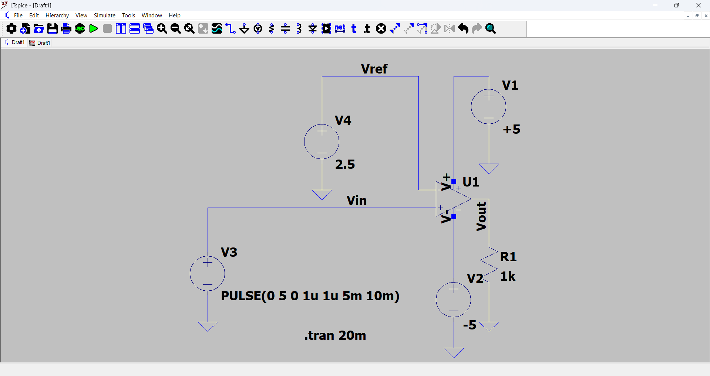
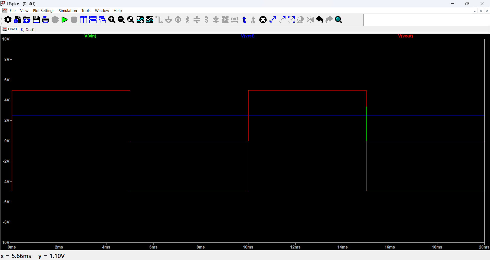

# Analog Comparator using Op-Amp (LTspice)

## Overview

This project demonstrates the design and simulation of an **analog comparator circuit** using an operational amplifier in LTspice. The circuit compares a pulsating time-varient input signal with a fixed reference voltage and produces a digital-like output. It helps us in visualising how analog signals can be converted into digital levels using comparator and to analyze threshold-based switching behavior.

---

### Components Used:

- Op-Amp (`UniversalOpamp2`)
- Voltage Source (Pulse input)
- DC Voltage Source (Reference)
- Resistor (Load)
- Dual Power Supply (+5V and -5V)
- Ground

---

## Circuit Configuration

- **Vin**: Pulse signal (0V to 5V)
- **Vref**: Constant 2.5V
- **Power Supply**:
  - +5V → V+
  - -5V → V-
- **Output**:
  - Connected to load resistor (1kΩ) to ground

---

## Working Principle

An op-amp used as a comparator compares two voltages:

- **Vin (Non-inverting input)**
- **Vref (Inverting input)**
- If **Vin > Vref** → Output goes HIGH (+5V approx)
- If **Vin < Vref** → Output goes LOW (-5V approx)

---

## Walkthrough

- Run the 'Comparator.asc' file within LTspice
- Click Plot Settings and choose Open Plot settings file
- Open the 'Comparator.plt' file and view the waveform

---

## Results

The waveform shows:

- Input signal toggling between 0V and 5V
- Output switching between +5V and -5V based on comparison

This confirms correct comparator behavior.

- Output switches sharply at **2.5V threshold**
- Demonstrates **analog-to-digital conversion concept**
- Output saturates near supply voltages

---

## Circuit

---

## Simulation Output

---

## Applications

- Zero-crossing detectors  
- Signal threshold detection  
- Analog-to-digital interfacing  
- Sensor-based switching systems  

---

## Author

Anushree Verma

---
